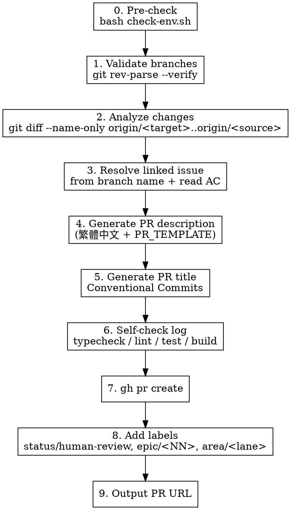

# Create GitHub Pull Request

開或更新一個 PR 從目前 branch 到 `main`，用 `gh` CLI 認證與呼叫 API。**所有開 PR 的 agent 必須走這個 skill**，不可自由發揮 description。

## Usage

`/github create-pr <target>` — 從目前 branch 開 PR 到 `target`（預設 `main`）
`/github create-pr <target> <source>` — 從 `source` 開 PR 到 `target`

## Process



**Pre-check**：`gh auth status` 必須成功。失敗就停下，請 user 跑 `gh auth login`。

## Step 1 — 取得並驗證 branches

- Source：argument 或 `git rev-parse --abbrev-ref HEAD`
- Target：第一個 argument（預設 `main`）
- 兩個都驗：`git rev-parse --verify origin/<branch>`（拿 **remote**、不要拿 local，local 可能 stale）

```bash
git fetch origin "$TARGET" "$SOURCE"
```

## Step 2 — 分析變更

對著 **remote** branch 比，拿正確的 diff：

```bash
git diff --name-only origin/$TARGET..origin/$SOURCE   # 改了哪些檔
git diff origin/$TARGET..origin/$SOURCE               # 全部 diff（寫描述用）
git log origin/$TARGET..origin/$SOURCE --oneline      # commits
```

## Step 3 — 找對應 issue

從 branch 名抽 issue 編號：

- `feature/epic-<NN>-<lane>-issue-<NN>` → 取最後的 `<NN>`
- `feature/<NN>-<slug>` → 取 `<NN>`

```bash
ISSUE_NUM=$(git rev-parse --abbrev-ref HEAD | grep -oE 'issue-[0-9]+|^[a-z]+/[0-9]+' | grep -oE '[0-9]+' | tail -1)
gh issue view "$ISSUE_NUM" --json title,body,labels
```

把 issue body 內的 AC 條目抓出來，PR description 要對應勾選。

## Step 4 — 產 PR description（繁體中文 + 用 `.github/PULL_REQUEST_TEMPLATE.md` 結構）

**強制要求**：

- **所有描述用繁體中文**（不是簡體）
- **只描述 diff 真的有的東西**，不要編造
- **保持 template 區段順序**：Pull Request Changes → AC traceability → Checklist → Self-check log → Breaking Changes → Deprecated → To-do → Architectural decisions → Screenshots / Demo → footer
- **空區段直接刪掉**（不要留「N/A」或「無」這種佔位文字）
- **footer `Closes #<NN>` 必填**（GitHub 看到這條會在 PR merge 後自動關掉對應 issue；用 `Refs Issue#NN` 不會自動關）

template 內容範例（拿 `.github/PULL_REQUEST_TEMPLATE.md` 開始填）：

```markdown
## Pull Request Changes

本 PR 為 Issue#<NN> 的第 X/Y 段切片，主要新增：

- <一句話描述每個檔案/模組的目的，繁體中文>
- <例：`<api 路徑模組>` — 實作 <某個 endpoint / behavior>>
- <例：`<UI component 路徑>` — 建立 <某個元件>，行為：...>

## AC traceability

- [x] AC-015 — `GET /charities` cursor pagination
- [x] AC-016 — `?q=` 搜尋（按 spec 定義的行為）
- [ ] AC-020 — types-drift CI（infrastructure; 等後續 PR 收斂）

## Checklist

- [x] 我已 local 測試過（必填）
- [x] Self-check log 已附（必填）
- [x] 對應的 unit / integration 測試已新增
- [ ] axe-core a11y 檢查通過（本 PR 無 UI 改動）
- [x] 不違反 AGENTS.md Hard Rule #16

## Self-check log

\`\`\`
✅ <依專案定義的 install / setup>
✅ <對應的 test runner，含通過數>
✅ <lint>
✅ <typecheck>
✅ <build>
\`\`\`

## Architectural decisions

- 對應 ADR-XXXX（描述本 PR 遵守的某條 architectural ADR）
- 對應 ADR-YYYY（同上）
- 或：不需新 ADR，因為本 PR 沒引入新的架構決策。

Closes #<NN>
```

## Step 5 — 產 PR title（Conventional Commits）

格式：`<type>(<scope>): <subject>`

- type ∈ `feat | fix | chore | refactor | docs | test | perf | ci | build`
- scope ∈ `api | web | e2e | repo | docs | …`（看影響範圍）
- subject：祈使句、繁體中文 OK、≤ 72 字

範例（依專案 scope 自填）：
- `feat(api): 新增 <endpoint> + <behavior>`
- `feat(web): 建立 <component>`
- `chore(repo): bootstrap monorepo + backend skeleton`

如果 PR 是 stacked / draft，前綴 `Draft: `（gh CLI 用 `--draft` flag 即可，title 不必加）。

## Step 6 — Self-check log

開 PR **之前**必跑專案定義的 self-check（typecheck + lint + test + build 至少這四項）。

任何一條紅就先修，不要硬開 PR。Output 的 ✅ / ❌ 直接貼進 Self-check log section。

## Step 7 — 開 PR

把 description 寫到暫存檔避免 shell quoting 問題，再用 `--body-file`：

```bash
BODY_FILE=$(mktemp)
cat > "$BODY_FILE" <<'EOF'
## Pull Request Changes
...（依上面 template 填好）...
Closes #42
EOF

gh pr create \
  --base "$TARGET" \
  --head "$SOURCE" \
  --title "feat(api): add /charities cursor pagination" \
  --body-file "$BODY_FILE"
```

如果是 update（PR 已存在）：

```bash
gh pr edit <num> --body-file "$BODY_FILE"
```

## Step 8 — Labels

每個 PR 開完都要補 label（這是 CI 跟 review pipeline 接得到的關鍵）：

```bash
gh pr edit <num> --add-label "status/human-review,epic/<NN>,area/<lane>,size/<s|m|l>"
```

`area/<lane>` 依照 issue 的 lane：`area/api` / `area/web` / `area/e2e`。
`size/` 依 hand-written LOC：`xs <50` / `s <200` / `m <500` / `l <800`。

## Step 9 — Output

回報 PR URL 給 caller（不是 user — caller 通常是 orchestrator 或 impl agent，會再呈現給 user）。

## 反 pattern（不要做）

- ❌ description 寫英文 — 本 harness 走繁體中文
- ❌ description 寫一行「fix bug」就送 — 必須走完整 template
- ❌ Self-check log 亂貼或編造 — 必須是真的跑出來的 output
- ❌ AC traceability 全部勾起來但實際沒交付 — 跨 agent review 會抓
- ❌ 留空 section 寫「N/A」「無」「TBD」— 直接刪掉
- ❌ footer 漏 `Closes #<NN>` — `ai-fix.yml` workflow 解析失敗會卡住
- ❌ 直接 `--body "$VAR"` 用 shell 變數 — 中文 / 換行容易壞掉，用 `--body-file` 暫存檔
