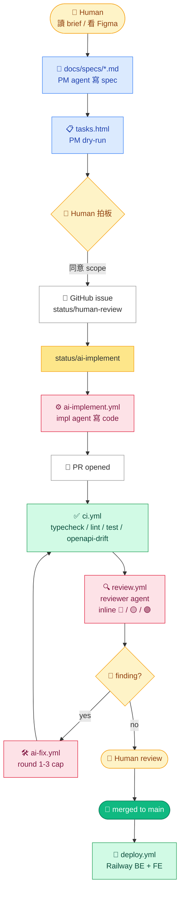

# 街口公益捐款列表 · JKO Charity List Replica

街口支付 App「所有捐款項目」頁面的 SPA 復刻 — 公益團體 / 捐款專案 / 義賣商品 三 tab 列表、cursor 無限滾動、CJK 子字串搜尋、類別 chip 過濾。

7-day take-home interview submission · 2026-05-18 → 2026-05-25。

## Demo

| Surface | URL |
|---------|-----|
| Web app | https://yihengwu-jko-interview-frontend.up.railway.app |
| API | https://yihengwu-jko-interview-backend.up.railway.app |
| Swagger UI | https://yihengwu-jko-interview-backend.up.railway.app/docs |
| Health | https://yihengwu-jko-interview-backend.up.railway.app/health |

詳細 demo 操作流程見 [`docs/DEMO.md`](docs/DEMO.md)。

## Stack

| Layer | Choice | Rationale |
|-------|--------|---------|
| FE framework | React 19 + Vite 6 + TypeScript 5.7 | 純 SPA、不需 SSR，Vite cold start 快 [ADR-0003](docs/decisions/0003-react-vite-over-nextjs.md) |
| FE styling | Tailwind v4 `@theme` CSS-first tokens | 街口紅 / radius / spacing 都吃 design token，避免 PostCSS pipeline [ADR-0008](docs/decisions/0008-tailwind-v4-theme-tokens.md) |
| FE data layer | TanStack Query v5 | infinite + cursor + AbortController + cache 一次到位 [ADR-0009](docs/decisions/0009-tanstack-query-as-data-layer.md) |
| FE UI primitives | 自家寫的 Button / Card / Tabs / Drawer / Dialog | a11y own、token 自己控、bundle 小 [ADR-0010](docs/decisions/0010-custom-ui-primitives.md) |
| FE testing | Vitest + React Testing Library | Vite 同生態 |
| FE catalog | Storybook 8 + Vite builder | UI primitive 視覺迭代 [ADR-0011](docs/decisions/0011-storybook-8-vite-builder.md) |
| FE lint | oxlint | 比 ESLint 快約 10× [ADR-0006](docs/decisions/0006-oxlint-over-eslint.md) |
| BE framework | Fastify 5 + `fastify-type-provider-zod` | Schema-first 與 Zod 嵌得深 [ADR-0013](docs/decisions/0013-fastify-over-express-hono-elysia.md) |
| BE schema | Zod single source of truth → OpenAPI auto-emit | FE/BE 對齊不漂移 [ADR-0004](docs/decisions/0004-zod-single-source-of-truth.md) · [ADR-0018](docs/decisions/0018-openapi-auto-emit-and-drift-ci.md) |
| DB | Postgres 16 + pg_trgm GIN | 內建 trigram 處理 CJK 子字串 [ADR-0014](docs/decisions/0014-prisma-over-drizzle-kysely.md) · [ADR-0015](docs/decisions/0015-pg-trgm-gin-over-fts.md) |
| Pagination | Cursor-based（`{created_at, id}` base64url）| 比 offset 穩、deep page 不會 O(n) [ADR-0005](docs/decisions/0005-cursor-pagination.md) |
| Wire format | snake_case + FE DTO mapper layer | BE 維持 snake_case 慣例、FE 寫 mapper 拿 camelCase [ADR-0007](docs/decisions/0007-wire-snake-case-with-fe-dto-layer.md) |
| Deploy | Railway（Docker per-workspace）| 一鍵 deploy + free tier 撐 demo [ADR-0016](docs/decisions/0016-railway-as-deploy-provider.md) |
| E2E | Playwright + axe-core a11y | 業界 standard，axe 把 a11y 變 enforceable |
| CI runners | ubuntu-latest（public repo unlimited minutes）| self-hosted mac runner 運維成本不划算後退回 cloud [ADR-0021](docs/decisions/0021-migrate-to-ubuntu-latest-runners.md) |

所有 ADR：[`docs/decisions/`](docs/decisions/)

## 本機跑

```bash
git clone https://github.com/YiHeng0221/yihengwu-jko-interview.git
cd yihengwu-jko-interview
pnpm install

# 起 Postgres（docker compose 或本機 Postgres 16）
docker compose up -d postgres

# backend
cd backend
cp .env.example .env  # 改 DATABASE_URL 指向本機
pnpm prisma migrate deploy
pnpm tsx prisma/seed.ts  # 270 charities（90 × 3 tabs）
pnpm dev  # http://localhost:3001

# frontend（另一個 terminal）
cd frontend
pnpm dev  # http://localhost:5173
```

## Architecture

```
yihengwu-jko-interview/
├── backend/                Fastify + Prisma + Zod
│   ├── prisma/
│   │   ├── schema.prisma
│   │   ├── migrations/     init + add_polymorphic_fields + category_codes_array
│   │   └── seed-data.ts    270 deterministic items, Lorem Picsum images
│   └── src/
│       ├── lib/
│       │   ├── schemas.ts  Zod single-source-of-truth
│       │   ├── toWire.ts   camelCase → snake_case mapper
│       │   ├── cursor.ts   base64url cursor codec
│       │   └── prisma.ts
│       ├── routes/         charities + categories + health
│       ├── plugins/        observability / swagger / cors / helmet / compression / rate-limit
│       └── generated/openapi.json  自動產出、commit 進 repo
├── frontend/               React + Vite + Tailwind v4
│   ├── nginx.conf          prod 用，含 CSP headers
│   └── src/
│       ├── features/
│       │   ├── charities/  CharityListPage + useCharityList + dto
│       │   ├── category/   CategoryDrawerDialog（mobile drawer + desktop dialog）
│       │   └── search/     SearchBar + SearchResults + useSearch
│       ├── hooks/          useDebounce / useIntersection / useMediaQuery / useOnline
│       ├── lib/
│       │   ├── layout/     TopBar + Tabs + SubRow + StickyHeaderStack
│       │   ├── ui/         Card / Button / Chip / Drawer / Dialog / icons/
│       │   └── env.ts      Zod-validated import.meta.env
│       └── styles/theme.css  Tailwind v4 @theme tokens（街口紅 / radius / spacing）
├── e2e/                    Playwright + axe-core
├── docs/
│   ├── decisions/          22 ADRs
│   ├── specs/              fe-feature-spec + be-feature-spec
│   ├── REVIEWS.md          cross-agent review entries (RR-NNN)
│   ├── HARNESS-PITFALLS.md AI-開發框架本身踩過的坑
│   ├── DEMO.md             5-min demo walkthrough
│   └── RETRO-PHASE-1.md    Phase 1 retrospective
└── .github/workflows/      ci · review · ai-fix · ai-implement · deploy · e2e · manual-seed
```

## 測試狀態

| 項目 | 狀態 |
|------|------|
| BE unit/integration（charities / categories / cursor / wire / errors） | ✅ 66 tests 全綠 |
| FE unit/integration（components / hooks / DTO / page with mocked fetch） | ✅ 225 tests 全綠 |
| E2E `smoke.spec.ts`（health + axe-core 首頁） | ✅ 已 ship |
| E2E list page golden path | ❌ 未寫 |
| E2E search overlay flow | ❌ 未寫 |
| E2E category drawer + filter | ❌ 未寫 |
| E2E axe-core 多 view state full scan | ❌ 未寫 |

7-day 期限內前後端 + UI polish + 多輪 AI workflow 占主要時間，先收 unit/integration 完整、E2E 留 smoke。Playwright + axe-core 工具鍊已 wire 好（`playwright.config.ts` + smoke spec + `e2e.yml` workflow），剩下 4 條 spec 寫法已列在 backlog。Demo 時走 `docs/DEMO.md` 步驟在 production URL 手跑完整流程。

## AI Workflow

本專案不是 IDE 內人開 prompt、AI 寫 code 的傳統工作流，而是把 PM / impl / reviewer / ai-fix 等多個 agent 角色透過 GitHub workflow 串成可重現 pipeline：



> Mermaid 看不到的話：[`PIPELINE.md`](PIPELINE.md) 有 ASCII 版。

幾個關鍵設計：

- **Human 在三個 gate 介入**：tasks.html 拍板 / 🔴 finding 是否轉 fix / final merge approval。三個都不可省略，AI 不會自己 merge。
- **AI-fix loop 有 3 round 上限**：第 3 round 還沒過就 escalate 給 human，避免無限 loop。
- **review.yml 唯讀**：reviewer agent 只留 inline comment，不會 push code。要改 code 走 ai-fix.yml 另一條 pipeline。
- **ci.yml 是 review 的前置**：先過 typecheck / lint / test / openapi-drift 才會觸發 review，避免 AI 評估 broken code。
- **每個 agent 寫成 `.claude/agents/<name>.md` persona file**，跑的時候 Claude Code Action 載入該 persona 當 system prompt。

**Agent personas**（`.claude/agents/`）：

| Persona | Job |
|---------|-----|
| `pm` | 讀 brief + Figma → 寫 spec + epic + child issues + tasks.html |
| `impl` | 讀 issue AC → 寫 code、commit、push、開 PR |
| `reviewer` | 讀 PR diff → inline-comment 🔴/🟡/🟣 findings（3 lens：correctness / security / architecture）|
| `ai-fix` | 讀 review comments → 修 🔴、push commit |
| `qa` | 讀 spec → 寫 Playwright + axe-core tests |
| `orchestrator` | 上面 multi-step 需要協調時介入 |

詳細流程 + 22 個 ADR + 踩坑紀錄見 [`docs/HARNESS-PITFALLS.md`](docs/HARNESS-PITFALLS.md) + [`PIPELINE.md`](PIPELINE.md)。

## AI 使用聲明

### 使用的 AI 工具

| Tool | 用途 |
|------|------|
| **Claude Code（CLI）** | 主要 driver — 跑 agent personas、CI 內 review.yml / ai-fix.yml / ai-implement.yml |
| **Claude Opus 4.7 / Sonnet 4.6** | 模型本體：heavy reasoning 用 Opus，standard impl / single-lens review 用 Sonnet |
| **GitHub Actions** | 跑整套 AI workflow — 沒用 Cursor / Copilot 等 IDE 工具 |

### AI 負責的範圍

- 多數 BE / FE / 測試實作（每 issue 走 PM → impl → review → ai-fix → human merge）
- 22 個 ADR 草稿（人在 fork 階段拍板選項，AI 寫 trade-off + consequences）
- 270 筆 seed data 生成腳本（template + Lorem Picsum 圖）
- Storybook stories
- 多數 Zod / Prisma schema + migration SQL
- Cross-agent code review（每 PR 跑一次 reviewer agent，留 🔴/🟡/🟣 inline comments）
- AI-fix loop 自動處理 review 抓到的 🔴 issue（3 round 上限）

### 我自己負責的範圍

- **所有架構決策的 fork 拍板**：選 React vs Next.js、Fastify vs Express、Prisma vs Drizzle、cursor vs offset、oxlint vs ESLint 等 — AI 列 options + trade-offs，最終由我選方向
- **所有 PR 的 human review + merge approval**：AI review 是 first pass，每張 PR 親自看過再 merge
- **PM 階段切票顆粒 + scope 控制**：tasks.html dry-run 親自拍板才開 issue，不讓 AI 開出 80 張 trivial ticket
- **UI / spec 對齊**：街口原 App 對照截圖、所有 Figma-spec 對應的 UI polish（chip 樣式 / 字距 / radius / 顏色 token 等 ~30 點）親自指認，AI 不主動猜
- **Bug 觀察 / 重現**：實際打開 demo 找到「捐款專案/義賣商品只顯示 title」這類資料層 bug、CSP error、CORS 問題等，先重現再交給 AI 修
- **Deploy 操作**：Railway 帳號設定、env vars / secrets 配置、DB migrate 觸發、密碼 rotation 等敏感操作

## Prompt 迭代摘要

挑 3 個代表性對話，呈現「怎麼下 prompt → AI 第一次回 → 修方向 → 採用結果」的迭代軌跡。

### 1. FE framework 拍板 — 從 Next.js push-back 到 Vite + React（2 rounds）

最初請 AI 直接產 FE，AI 預設用 **Next.js**（沒問需求）。

**Round 1 push-back**：丟 3 個質疑 + 1 句 framing：
- 作業沒要求 Next.js
- RSC 學習成本高
- Turbopack 難用
- 「Next.js 解決了 20% 的進階效能問題，卻把剩下 80% 的簡單事情變得極度痛苦與不安全。」

AI 認可拋出的訴求，但要求提供具體替代方案再做研究。

**Round 2 research**：給 3 個候選 — TanStack Start（用 TanStack Router）/ React Router v7（前 Remix）/ Astro（用 React）。AI research 後逐個否決：
- **TanStack Start**：太新、SSR 心智模型仍在；feature-set 演進中
- **React Router v7**：full-stack 路線跟「Pure SPA」spec 矛盾
- **Astro**：MPA + islands 模型，FE 動態行為（infinite scroll + filter + drawer）反而綁手綁腳

回到 first principles，AI 收斂提案到 **Vite + React**（不在原候選 3 個內）。

**採用**：Vite 6 + React 19 + React Router v7。`vite build < 15s`、HMR < 200ms、FE/BE 獨立 Docker image。詳見 [ADR-0003](docs/decisions/0003-react-vite-over-nextjs.md)。

**Lesson**：AI 第一次預設熱門 framework 是 social proof bias，給具體 spec 約束 + 質疑 + 候選名單後才會回到 first principles 重新評估。

### 2. Harness pitfall — 一次性 ops 塞進 deploy chain（[HARNESS-PITFALLS §C1](docs/HARNESS-PITFALLS.md)）

第一版 BE Dockerfile 把 `prisma db seed` 塞進 CMD 想說「deploy 一次到位」。

**Outcome**：每次 BE redeploy 都 re-seed → row 重複 + 計數爆掉 + log 全是 unique violation error。

**修法 iteration**：
- Round 1：AI 提議把 `--upsert` flag 加進 seed script — 治標但 deploy chain 仍非冪等
- Round 2：抽成獨立 `manual-seed.yml` workflow_dispatch，需要 demo 才手動 trigger；CMD 只留 `prisma migrate deploy && node dist/server.js`
- Bonus：Manual workflow 加 `confirm: 'seed'` input guard 避免誤觸

**Lesson**：deploy chain 只能放冪等 ops；一次性 ops 必須獨立 entry point + 加 confirm guard。

### 3. Harness pitfall — Cross-agent reviewer 看到一審結果 → correlated blind spots（[HARNESS-PITFALLS §C5](docs/HARNESS-PITFALLS.md)）

設計 cross-agent review pipeline 時，第一版把 first reviewer 的 findings paste 進 second reviewer 的 prompt。

**症狀**：兩個 reviewer 高度一致認可 PR，但 PR merge 後仍有明顯 bug。Cross-agent review 變成 echo chamber。

**根因**：second reviewer 被 first reviewer 的 reasoning frame 拉住，盲點對齊（correlated errors）。

**修法**：
- second reviewer 必須 **fresh context** — 只看 PR diff，不看 first reviewer 留下任何 inline comment / summary
- 兩個 reviewer 都寫獨立 verdict 進 `docs/REVIEWS.md` 同一個 RR-NNN 條目下，明白標 disagreement
- agreement 高的 PR 跟 disagreement 高的 PR 都記錄，後者反而是訊號強的

**Lesson**：真要交叉驗證，information barrier 要實作對；不然「兩個 AI 看過」反而比一個還糟（false confidence）。

## License

MIT（personal interview submission，請勿商用）。
